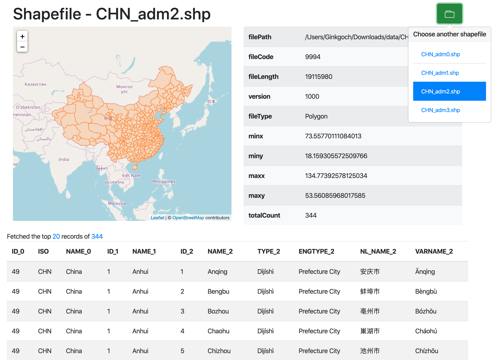

# Shapefile Command Line Tool
This is a command line tool to help to inspect a specified shapefile. It provides function to inspect a specified shapefile's header, fields, records etc.

## Install
```terminal
# global install
npm i -g ginkgoch-shapefile-cli

# local install
npm i --save ginkgoch-shapefile-cli
```

## Help
```terminal
shapefile-cli --help
```
Usage: `index command [options] <file>`

Options:
```terminal
-V, --version                  output the version number
-h, --help                     output usage information
```
Commands:
```terminal
show-header [options] <file>       Output shapefile header information
show-fields [options] <file>       Output shapefile fields information
show-records [options] <file>      Output shapefile records information
convert-geojson [options] <file>   Convert shapefile to GeoJson
build-index [options] <fileOrDir>  Build index for shapefile
reproject [options] <file>         Re-project shapefile to a specific SRS
serve [options] <file>             Launch a server for exploring shapefile on browser
```

## Show Header
Show header help
```terminal
node index.js show-header --help
```
Usage: `show-header [options] <file>`

Options:
```terminal
-p, --pretty  output header with pretty table format
-h, --help    output usage information
```
Example - print a shapefile's header with pretty table format 
```terminal
shapefile-cli show-header ~/Downloads/data/shp/USStates.shp -p
╔════════════╤═════════════════════╗
║ fileCode   │ 9994                ║
╟────────────┼─────────────────────╢
║ fileLength │ 222344              ║
╟────────────┼─────────────────────╢
║ version    │ 1000                ║
╟────────────┼─────────────────────╢
║ fileType   │ Polygon             ║
╟────────────┼─────────────────────╢
║ minx       │ -178.21502685546875 ║
╟────────────┼─────────────────────╢
║ miny       │ 18.924781799316406  ║
╟────────────┼─────────────────────╢
║ maxx       │ -66.9698486328125   ║
╟────────────┼─────────────────────╢
║ maxy       │ 71.40664672851562   ║
╚════════════╧═════════════════════╝
```

## Show Fields
Show fields help
```terminal
shapefile-cli show-fields --help
```

Usage: `show-fields [options] <file>`

Options:
```
-p, --pretty  output fields with a pretty table format
-h, --help    output usage information
```

Example - print a shapefile's fields info in pretty table format.
```terminal
shapefile-cli show-fields ~/Downloads/data/shp/USStates.shp -p
╔════════════╤══════╤════════╤═════════╗
║ name       │ type │ length │ decimal ║
╟────────────┼──────┼────────┼─────────╢
║ AREA       │ N    │ 12     │ 3       ║
╟────────────┼──────┼────────┼─────────╢
║ PERIMETER  │ N    │ 12     │ 3       ║
╟────────────┼──────┼────────┼─────────╢
║ STATE_     │ N    │ 11     │ 0       ║
╟────────────┼──────┼────────┼─────────╢
║ STATE_ID   │ N    │ 11     │ 0       ║
╟────────────┼──────┼────────┼─────────╢
║ STATE_NAME │ C    │ 25     │ NaN     ║
╟────────────┼──────┼────────┼─────────╢
║ STATE_FIPS │ C    │ 2      │ NaN     ║
╟────────────┼──────┼────────┼─────────╢
║ SUB_REGION │ C    │ 7      │ NaN     ║
╟────────────┼──────┼────────┼─────────╢
║ STATE_ABBR │ C    │ 2      │ NaN     ║
╟────────────┼──────┼────────┼─────────╢
║ POP1990    │ N    │ 9      │ 0       ║
╟────────────┼──────┼────────┼─────────╢
║ RECID      │ N    │ 9      │ 0       ║
╚════════════╧══════╧════════╧═════════╝
```

## Show Records
Show records help
```terminal
shapefile-cli show-records --help
```

Usage: `show-records [options] <file>`

Options:
```terminal
-l, --limit <n>        returning records limit. accept any number. 0 means all records. default to 10
-c, --columns <items>  returning columns include in the results. Multiple columns are supported by separater ",". Default to all columns
-g, --geom             includes geometry in the returned content
-p, --pretty           output records with a pretty table format
-h, --help             output usage information
```

Example - print a shpefiles's top 10 records info with field name `STATE_NAME`, `RECID` and geometry in pretty table format.
```terminal
shapefile-cli show-records ~/Downloads/data/shp/USStates.shp -g -l 10 -c STATE_NAME,RECID

╔══════════════╤═══════╤════════════════════════════════╗
║ STATE_NAME   │ RECID │ geom                           ║
╟──────────────┼───────┼────────────────────────────────╢
║ Washington   │ 1     │ [[{"x":-122.40074920654297,... ║
╟──────────────┼───────┼────────────────────────────────╢
║ Montana      │ 2     │ [[{"x":-111.4746322631836,"... ║
╟──────────────┼───────┼────────────────────────────────╢
║ Maine        │ 3     │ [[{"x":-69.77778625488281,"... ║
╟──────────────┼───────┼────────────────────────────────╢
║ North Dakota │ 4     │ [[{"x":-98.73005676269531,"... ║
╟──────────────┼───────┼────────────────────────────────╢
║ South Dakota │ 5     │ [[{"x":-102.78793334960938,... ║
╟──────────────┼───────┼────────────────────────────────╢
║ Wyoming      │ 6     │ [[{"x":-104.05310821533203,... ║
╟──────────────┼───────┼────────────────────────────────╢
║ Wisconsin    │ 7     │ [[{"x":-87.74845123291016,"... ║
╟──────────────┼───────┼────────────────────────────────╢
║ Idaho        │ 8     │ [[{"x":-117.02530670166016,... ║
╟──────────────┼───────┼────────────────────────────────╢
║ Vermont      │ 9     │ [[{"x":-73.25850677490234,"... ║
╟──────────────┼───────┼────────────────────────────────╢
║ Minnesota    │ 10    │ [[{"x":-91.73021697998047,"... ║
╚══════════════╧═══════╧════════════════════════════════╝

Reading complete. 10/51 record(s)

Tips:
 - set option -l, --limit to 0 to read all records
 - use option -g, --geom to 0 to read all records with geometry
 - use option -p, --pretty to return data with pretty table format
 - use option -c, --column to return necessary fields. e.g. -c field1,field2 returns two fields
```

## Convert to GeoJson
Convert shapefile to GeoJSON format help
```terminal
shapefile-cli convert-geojson --help
```

Usage: `convert-geojson [options] <file>`

Options:
```terminal
-c, --columns <items>  returning columns include in the results. Multiple columns are supported by separater ",". Default to all columns
-o, --output <value>   output file path. If only directory is specified, the same file name will be used. Default to the same folder of the sourceShapefile
-h, --help             output usage information
```

Example - converts a shapefile to GeoJson format.
```terminal
shapefile-cli convert-geojson ./tests/data/USStates.shp

Conversion complete. New file is saved at ./tests/data/USStates.json.
```

## Build index
Build spatial index help
```bash
shapefile-cli build-index --help
```

Usage: `build-index [options] <fileOrDir>`

Options:
```bash
-w, --overwrite  Overwrite if index files exist. Default is "false"
-h, --help       output usage information
```

## Re-projection
Re-project from current coordinate system to another help
```bash
shapefile-cli reproject --help
```

Usage: `reproject [options] <file>`

Options:
```bash
--outputSrs <outputSrs>  [Required] The target SRS. It is required
--sourceSrs <sourceSrs>  the source SRS. If .prj file doesn't exist, this option will be applied as source SRS
-o, --output <output>    the output shapefile path. Default is the source file name with "_[targetSRS]" suffix
-w, --overwrite          overwrite if index files exist. Default is "false"
-h, --help               output usage information
```

## Launch a server
Launch a server for exploring shapefile on browser.
```bash
shapefile-cli reproject --help
```

Usage: `serve [options] <file>`

Options:
```bash
-p, --port <port>  the server port exposed to browse, default port is 3000
-h, --help         output usage information
```

Screenshot:


## Issues
Contact [ginkgoch@outlook.com](mailto:ginkgoch@outlook.com) or [submit an issue](https://github.com/ginkgoch/node-shapefile-cli/issues).
